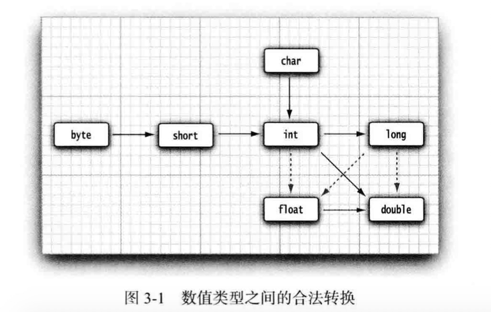
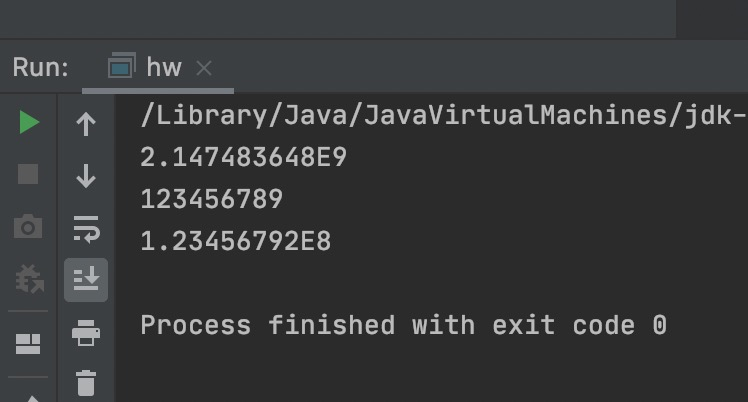

# java的基本程序设计结构

## 一个简单的java应用程序

```java
public class FirstSample
{
  public static void main(String[] args)
  {
    System.out.println("we will not use 'Hello,World!'");
  }
}
```

这是一个最简单的java程序，但是所有的java应用程序都具有这种结构，其中的`public`称为访问修饰符，这些修饰符用于控制程序
的其他部分对这段代码的访问级别。在第5章会详细介绍访问修饰符的具体内容。java程序的全部内容都应该包含在类中，java文件只应该有一个public类，但允许有许多非public类，但不常用。类名命名使用驼峰标记法。其中源代码的文件名必须与公共类的名字相同。编译源代码后会得到一个包含这个类字节码的`class`文件，一般与源文件存储在同一个目录。

编译java文件

```
javac FirstSample.java
```

解释二进制文件

```
java FirstSample
```

java中的大括号{}用来划分程序的各个部分（统称为块），等同于python的冒号：。在java中，一条语句必须用分号来结束。

## 注释

三种注释方式

1. `//`单行注释符
2. 多行注释符
   ```java
   /*
   *
   *
   */
   ```
3. 文档注释符，会自动生成文档
   ```java
   \**
   *
   *
   */
   ```
注意注释符之间不能嵌套。

## 数据类型

java是一种强类型语言，意味着必须为变量声明一个类型。在java中，一共有8种基本类型，其中4种整形，2种浮点类型，1种用于表示Unicode编码的字符单元的字符类型char，和1种用于表示真值的布尔类型。

### 整形


<table>
  <thead>
    <tr>
      <th>类型</th>
      <th>存储需求</th>
      <th>取值范围</th>
    </tr>
  </thead>
  <tbody>
    <tr>
      <td>int</td>
      <td>4字节</td>
      <td>-2^31-2^31</td>
    </tr>
    <tr>
      <td>short</td>
      <td>2字节</td>
      <td>-2^15-2^15</td>
    </tr>
    <tr>
      <td>long</td>
      <td>8字节</td>
      <td>-2^63-2^63</td>
    </tr>
    <tr>
      <td>byte</td>
      <td>1字节</td>
      <td>-2^7-2^7</td>
    </tr>
  </tbody>
</table>


整形中，int为默认类型，即通常情况下，如果JAVA中出现了一个整数数字比如35，那么这个数字就是int型的。

* 如果我们希望它是byte型的，可以在数据后加上 B或者b：35B（表示它是byte型的）
* 同样的35S（或者s）表示short型
* 35L（或者l）表示long型的，表示int我们可以什么都不用加，但是如果要表示long型的，就一定要在数据后面加“L或者l”

对于进制表示有如下前缀：

* 十六进制数值前缀为`0x或者0X`
* 八进制前缀为`0`
* 从java7开始，加上前缀`0b或者0B`，二进制
* 还可以为数字字面量加下划线（易读）

### 浮点类型

用于表示小数的数值。

| 类型        | 存储需求    |  取值范围  |
| --------   | -----:   | :----: |
| float        | 4字节      |   大约$\pm3.40282347E+38F$（有效位数6-7位）    |
| double        | 8字节      |   大约$\pm1.7976931348623150E+308$（有效位数15位）    |

浮点类型double是默认类型，需要表示float的类型需要在数字字面量后面加f或者F。

关于浮点数的取值范围如何得到，涉及一些事情暂时没有搞懂，待续

当用十六进制表示浮点数值时候，如 `0.125=2^-3`表示成0x1.0p-3。在十六进制表示法中，使用p表示指数而不是e。注意尾数采用十六进制，指数采用十进制。指数的基数是2，而不是10。（以后会详细解释下）

所有浮点数值计算都遵循IEEE754规范。

有三种表示溢出和出错情况的三种特殊浮点数值：

* 正无穷大
* 负无穷大
* NaN（不是一个数字）

java中`Double.POSITIVE_INFINITY,Double.NEGATIVE_INFINITY,Double.NaN`（以及响应的Float类型常量），检验NaN使用特定的类的isNaN函数。

用于准确表示浮点数的类BigDecimal。

### char类型

用一个字符或者字符组合表示的Unicode字符，char类型的字面量值需要用单引号括起来。char类型的值可以表示为十六进制值，其范围从`\u0000`到`\Uffff`（<font color='red'>这里的大小写u有区别吗</font>）,并且转义序列`\u`还可以出现在加引号的字符常量或字符串之外。（其他所有转义序列不可以）

注意：Unicode转义序列会在解析代码之前得到处理。

### boolean类型

注意：整数值和布尔值之间不能进行相互转换。（这和其他语言不大一样）

## 变量

java中，每个变量都有一个类型，在声明变量时候，变量的类型位于变量名之前。变量名必须是一个以字母开头并由字母（包括`_`）或者数字构成的序列。

如果想知道哪些Unicode字符属于java中的字母，可以使用Character类的isJavaIdentifierStart和isJavaIdentifierPart方法来检查。尽管$是一个合法的java字符，但不要在你自己的代码中使用这个字符，它只用在java编译器或者其他工具生成的名字中。可以在一行声明多个变量。

### 变量初始化

声明一个变量后，需要用赋值语句对变量进行显式初始化，千万不要使用未初始化的变量，会报错。另外，在java中可以将声明放在代码中的任何地方（声明来就行，位置无所谓），这有点类似js中的变量声明。

### 常量

在java中，利用关键字`final`指示常量。例如`final double PI=3.14`

关键字final表示这个变量只能被赋值一次。一旦被赋值之后，就不能再更改了。习惯上，常量名使用全大写。在java中，可以在一个类中的多个方法中使用的常量叫类常量。关键字为`static final`。注意，类常量的定义位于main方法的外部，而且一个常量被声明为public，那么其他类的方法都可以使用这个常量。`public static final double PI=3.14`

## 运算符

算术运算符基本和python3的一样。

### 数学函数与常量

Math类中包含各种各样的数学函数。其中由于`%`如果负数去模会产生负数，引入floorMod方法解决这个问题。如果不在数学方法名和常量名前添加“Math”，那么只要在源文件的顶部上加`import static java.lang.Math`。第四章讨论静态导入。

### 数值类型之间的转换



图中有6个实心箭头，表示无信息丢失的转换，有3个虚箭头，表示有可能有精度损失的转换。举个例子

```java7
public class hw {
    public static void main(String[] args){
        double n=Math.pow(2,31);
        int a=123456789;
        float b=a;
        System.out.println(n);
        System.out.println(a);
        System.out.println(b);

    }
}


```

得到的结果如图



从图中可以看出int a并未超出int类型，但是转换成float类型，由于浮点数问题，精度有一定的丢失。当使用这些数值进行二元操作时候，系统要将两个操作数转换为同一种类型，然后再进行计算

* 如果两个操作数有一个是double类型，另一个操作数会转换成double类型
* 否则，其中一个为float，另一个也变成一样
* 否则，long
* 否则，都变成int计算

### 强制类型转换

强制类型转换的语法格式是在圆括号中给出想要转换的目标类型，后紧跟待转换的变量名。例如

```java7
double x=9.997;
int nx=(int) x;

```

截断小数部分转换为9。如果要对浮点数进行舍入运算，要使用`Math.round`

```java7
double x=9.997;
int nx=(int) Math.round(x);
```

由于round方法返回的结果为long型，所以还需要使用int转换。

### 位运算符

处理整形类型时候，可以直接对组成整形数值的各个位置完成操作。这意味着可以用掩码技术得到整数中的各个位。运算符包括：

* `&`位且
* `|`位或
* `^`位异或
* `~`位非
