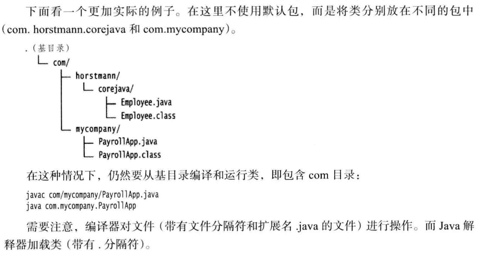

# 对象与类

* 面向对象程序设计概述
* 使用预定义类
* 用户自定义类
* 静态域与静态方法
* 方法参数
* 对象构造
* 包
* 类路径
* 文档注释
* 类设计技巧

## 面对对象程序设计概述

对于一些规模较小的问题，将其分解为过程的开发方式比较理想。而面向对象更加适用于解决规模较大的问题。要想实现一个简单的web浏览器可能需要大约2000个过程，这些过程可能需要对一组全局数据进行操作。采用面向对象的设计风格，可能只需要大约100个类，每个类平均包含20个方法。后者更易于程序员掌握，也容易找到bug。

### 类

类是构造对象的模版或者蓝图，由类构造对象的过程叫创建类的实例，对象中的数据称为实例域，操纵数据的过程称为方法。对于每个特定的类实例（对象）都有一组特定的实例域值，这些值的集合就是这个对象的当前状态，并可能随时改变。

实现封装的关键在于绝对不能让类中的方法直接地访问其他类的实例域。程序仅通过对象的方法与对象数据进行交互。

### 对象

对象的三个主要特性：

* 对象的行为：可以对对象施加哪些操作，或可以对对象施加哪些方法？
* 对象的状态：当施加那些方法时候，对象如何响应？
* 对象标识：如何辨别具有相同行为与状态的不同对象？

## 使用预定义类

在java中，并不是所有的类都具有面向对象特征，例如Math类。

### 对象与对象变量

要想使用对象，就必须首先构造对象，并指定其初始状态。然后，对对象应用方法。在java中，使用构造器构造新实例。构造器是一种特殊的方法，用来构造并初始化对象。下面看一个例子，在标准java库中有一个Date类，它的对象将描述一个时间点。

构造器的名字应该与类名相同，因此Date类的构造器名为Date，要想构造一个Date对象，需要在构造器前面加上new操作符，如：`new Date()`，这个表达式构造一个新对象。这个对象被初始化为当前的日期和时间。Date类中有一个`toString`方法，这个方法返回日期的字符串描述。

在对象与对象变量之间存在着一个重要的区别。例如：`Date deadline;//deadline doesn't refer to any object`

定义了一个对象变量deadline，它可以引用Date类型的对象。但是，一定要认识到，变量deadline不是一个对象，只是一个对象变量，实际上也没有引用对象。此时，不能将任何Date方法应用于这个变量上。必须首先初始化变量deadline，这里有两个选择。当然，可以用新构造的对象初始化这个变量：`deadline=new Date();`，也可以让这个变量引用一个已存在的对象：`deadline=birthday;`，现在，这两个变量引用同一个对象。

一定要认识到：<font color='red'>一个对象变量并没有实际包含一个对象，而仅仅引用一个对象。</font>

在java中，任何对象变量的值都是对存储在另外一个地方的一个对象的引用。new操作符的返回值也是一个引用。下列语句：`Date deadline=new Date();`有两个部分。表达式`new Date()`构造了一个Date类型的对象，并且它的值是对新创建对象的引用。这个引用存储在变量deadline中。

可以显示地将对象变量设置为null，`deadline=null`表明这个对象变量目前没有引用任何对象。

如果将一个方法应用在一个值为null的对象上，那么就会产生错误。

### java类库中的LocalDate类

将时间与日历分开是一种很好的面向对象设计。通常，最好使用不同的类表示不同的概念。

不要使用构造器来构造LocalDate类的对象。实际上，应当使用静态工厂方法（factory method）代表你调用构造器（<font col='red'>具体为什么不能用new呢？</font>）。下面的表达式

```java7
LocalDate.now();
```

会构造一个新对象，表示构造这个对象时的日期。也可以提供年，月，日来构造对应一个特定日期的对象：

```java7
LocalDate newYearEve = LocalDate.of(1999,12,31);
```

一旦有了一个LocalDate对象，可以用方法`getYear,getMonthValue,getDayOfMonth`得到年，月，日。当需要加一些日子，可用`plusDays`得到一个新的LocalDate。

### 更改器方法与访问器方法

* 如果一个方法是更改器方法，那么对象在调用这个方法后，对象的状态会发送改变，那么就称这个方法为更改器方法。
* 相反，只访问对象而不修改对象的方法有时称为访问器方法。

## 用户自定义类

我们之前已经写过自己的类了，不过比较简单，只包含一个main方法。现在开始学习如何设计复杂应用程序所需要的各种主力类（workhorse class）。通常，这些类没有main方法，却有自己的实例域和实例方法。要想创建一个完整的程序，应该将若干类组合在一起，其中只有一个类有main方法。

在java中，最简单的类定义形式为：

```java7
class ClassName
{
  field1
  field2
  ...
  constructor1
  constructor2
  ...
  method1
  method2
  ...
}
```

下面给出一个非常简单的Employee类。

```java7
class Employee
{
  // instance fields
  private String name;
  private double salary;
  private LocalDate hireDay;

  // constructor
  public Employee(String n,double s,int year,int month,int day)
  {
    name=n;
    salary=s;
    hireDay=LocalDate.of(year,month,day);
  }

  // a method
  public String getName()
  {
    return name;
  }

  // more methods
  ...
}
```

### 剖析Employee类

这个类包含类一个构造器和1个方法，这个类的方法被标记为public。关键字public意味着任何类的任何方法都可以调用这个方法。接下来，在Employee类的实例中有三个实例域用来存储将要操作的数据。关键字private确保只有Emplyee类自身的方法能够访问这些实例域，而其他类的方法不能读写这些域。

### 从构造器开始

可以看到，构造器与类同名。在构造Emplyee类的对象时，构造器会运行，以便将实例域初始化为所希望的状态。使用如下代码创建实例：

```java7
new Emplyee("James Bond",100000,1950,1,1);
```

构造器与其他的方法有一个重要的不同。构造器总是伴随着new操作符的执行被调用，而不能对一个已经存在的对象调用构造器来达到重新设置实例域的目的。

这里列出构造器的性质：

* 构造器与类同名
* 每个类可以有一个以上的构造器
* 构造器可以有0个，1个或多个参数
* 构造器没有返回值
* 构造器总是伴随着new操作一起调用

注意，不要在构造器中定义与实例域重名的局部变量，如这样：

```java7
class Employee
{
  // instance fields
  private String name;
  private double salary;
  private LocalDate hireDay;

  // constructor
  public Employee(String n,double s,int year,int month,int day)
  {
    String name=n; //Error
    double salary=s; //Error
    hireDay=LocalDate.of(year,month,day);
  }

  ...
}
```

这个构造器声明类局部变量name和salary，这些变量只能在构造器内部访问。这些变量屏蔽类同名的实例域。


### 隐式参数与显示参数

方法用于操作对象以及存取它们的实例域。例如，方法：

```java7
public void raiseSalary(double byPercent)
{
  double raise=salary+byPercent/100;
  salary+=raise;
}
```

<font color='red'>在这个方法中，声明了raise局部变量（应该只存在这个块作用域中）</font>

将调用这个方法的对象的salary实例域设置为新值。`raiseSalary`方法有两个参数，第一个参数为隐式参数，是出现在方法名前的Employee类对象。第二个参数位于方法名后面括号中的数值，这是一个显示参数。

可以看到，显示参数是明显地列在方法声明中的，例如`double byPercent`。隐式参数没有出现在方法声明中。

在每个方法中，关键字`this`表示隐式参数。如果需要的话，可以用下列方式编写`raiseSalary`方法：

```java7
public void raiseSalary(double byPercent)
{
  double raise = this.salary*byPercent/100;
  this.salary+=raise;
}
```

有些程序员更偏爱这样的风格，因为这样可以将实例域与局部变量明显地区分开来。`this`这种表示法应该是表示实例域的。

### 封装的优点

最后，我们仔细看一下非常简单的`getName`方法

```java7
public String getName()
{
  return name;
}
```

这些都是典型的访问器方法。由于它们只返回实例域值，因此又称为域访问器。

### 基于类的访问权限

从前面已经知道，方法可以访问所调用对象的私有数据。其实，一个方法可以访问所属类的所有对象的私有数据。举个例子

```java7
class Employee
{
  ...
  public boolean equals(Emplyee other)
  {
    return name.equals(other.name);
  }
}
```

典型的调用方式是

```java7
if (harry.equals(boss)) ...
```

这个方法访问类harry的私有域，而且也访问了boss的私有域。原因就是boss也是Employee类对象，而Employee类的方法可以访问Emplyee类的任何一个对象的私有域。

### final实例域

可以将实例域定义为final。构建对象时必须初始化这样的域。也就是说，必须确保在每一个构造器执行之后，这个域的值被设置，并且在后面的操作中，不能够再对它进行修改。例如，可以将Emplyee类的name域声明为final，因为在对象构建之后，这个值不会再被修改，即没有setName方法。

`private final String name;`

## 静态域与静态方法

说一下static这个修饰符的含义。

### 静态域

如果将域定义为static，每个类中只有一个这样的域。而每一个对象对于所有的实例域却都有自己的一份拷贝。例如，假定需要给每一个雇员赋予唯一的标识码。这里给Employee类添加一个实例域id和一个静态域nextId：

```java7
class Employee
{
  private static int nextId=1;
  private int id;
  ...
}
```

现在，每一个雇员对象都有一个自己的id域，但这个类的所有实例将共享一个nextId域。换句话说，如果有1000个Employee类的对象，则有1000个实例域id。但是，只有一个静态域nextId。即使没有一个雇员对象，静态域nextId也存在。它属于类，而不属于任何独立的对象。

<font color='red'>这里我感觉静态域就像python的类变量，属于类的，调用使用的时候，也需要类名加.调用，而实例域就类似对象（实例）变量。</font>

### 静态常量

跟静态域差不多，只不过是个常量

### 静态方法

静态方法是一种不能向对象实施操作的方法。例如，Math类的pow方法就是一个静态方法。表达式

```java7
Math.pow(x,a)
```

在运算时候，不使用任何Math对象。换句话说，没有隐式的参数。

Employee类的静态方法不能访问Id实例域，因为它不能操作对象。但是，静态方法可以访问自身类中的静态域。例如

```java7
public static int getNextId()
{
  return nextId;
}
int n = Employee.getNextId();
```

这个方法可以省略关键字static，但是，需要通过Emplyee类对象的引用调用这个方法。


### 工厂方法

静态方法还有另外一种常见的用途。类似LocalDate和NumberFormat的类使用静态工厂方法来构造对象。为什么NumberFormat类不利用构造器完成这些操作呢？主要有两个原因：

* 无法命名构造器。构造器的名字必须与类名相同。但是，这里希望得到的货币实例和百分比实例采用不同的名字
* 当使用构造器的时候，无法改变所构造的对象类型。而工厂方法将返回一个DecimalFormat类对象，这是NumberFormat的子类。

### main方法

main方法也是一个静态方法。main方法不对任何对象进行操作。事实上，在启动程序时候，还没有任何一个对象。静态的main方法将执行并创建程序所需要的对象。

## 方法参数

在将参数传递给方法（或函数）的过程中

* 按值调用，表示方法接受的是调用者提供的值
* 按引用调用，表示方法接收的是调用者提供的变量地址

一个方法可以修改传递引用所对应的变量值，而不能修改传递值调用所对应的变量值。

java程序设计语言总是采用按值调用。也就是说，方法得到的是所有参数值的一个拷贝，特别是，方法不能修改传递给它的任何参数变量的内容。

有关值传递还是引用传递，这里的说法还是很清楚的， [点击前往](https://www.zhihu.com/question/31203609)

## 对象构造

前面已经学习类编写简单的构造器，可以定义对象的初始状态。但是，由于对象构造非常重要，所以java提供类多种编写构造器的机制。

### 重载

如果多个方法有相同的名字，不同的参数，便产生了重载。编译器必须挑选出具体执行哪个方法，它通过用各个方法给出的参数类型与特定方法调用所使用的值类型进行匹配来挑选出相应的方法。（相当于R语言的泛型函数）

### 默认域初始化

如果在构造器中没有显式地给域赋予初始值，那么就会被自动地赋予默认值。但不建议不明确初始化。

### 无参数的构造器

很多类都包含一个无参数的构造函数，对象由无参数构造函数创建时候，其状态会设置为适当的默认值。如果在编写一个类时候没有编写构造器，那么系统会提供一个无参数构造器。将所有实例域设置为默认值。

注意，当且仅当没有提供任何构造器的时候，系统才会提供一个默认的构造器。如果存在任何一个，要想无参数初始化，用户都要提供一个无参数构造器。

### 调用另一个构造器

关键字this引用方法的隐式参数。然而，这个关键字还有另外一个含义。如果构造器的第一个语句形如`this(...)`，那么这个构造器将调用同一个类的另一个构造器。例子

```java7
public class Person {
    private String name;
    private int age;

    public Person() {
        this("Dick", 12);
    }

    public Person(String n) {
        this(n, 12);
    }

    public Person(String n, int a) {
        name = n;
        age = a;
    }
}
```

### 初始化块

前面已经讲过两种初始化数据域的方法：

* 在构造器中设置值
* 在声明中赋值

还有第三种方法：初始化块。在一个类的声明中，可以包含多个代码块。只要构造类的对象，这块就会被执行。例如

```java7
class Employee
{
  private static int nextId;

  private int id;
  private String name;
  private double salary;

  //object initialization block
  {
    id=nextId;
    nextId++;
  }
  public Employee(String n,double s)
  {
    name=n;
    salary=s;
  }
  public Employee()
  {
    name="";
    salary=0;
  }
  ...
}
```

在这个实例中，无论使用哪个构造器构砸对象，id域都在对象初始化块中被初始化。首先运行初始化块，然后才运行构造器的主体部分。

## 包

java允许使用包将类组织起来。借助包可以方便地组织自己的代码，并将自己的代码与别人提供的代码库分开管理。

标准的java类库分布在多个包中，包括`java.lang,java.util,java.net`等。标准的java包具有一个层次结构。如同硬盘的目录嵌套一样（这个形容不错）。从编译器的角度来看，嵌套的包之间没有任何关系。例如，`java.util`和`java.util.jar`毫无关系。每一个都拥有独立的类集合。

### 类的导入

一个类可以使用所属包中的所有类，以及其他包中的公有类。我们可以采用两种方式访问另一个包中的公有类。

1. 在每个类名之前添加完整的包名。如：`java.time.LocalDate today=java.time.LocalDate.now();`，这显然很麻烦。
2. 使用`import`语句，这是一种引用包含在包中的类的简明描述。如：`import java.uitl.*;`。

### 静态导入

import语句不仅可以导入类，还增加类导入静态方法和静态域的功能。例如，如果在源文件的顶部，添加指令：`import static java.lang.System.*;`，就可以使用System类的静态方法和静态域，而不必加类名前缀：

```java7
out.println("bye);
exit(0);
```

另外，还可以导入特定的方法或域。

### 将类放入包中

要想将一个类放入包中，就必须将包的名字放在源文件的开头，包中定义类的代码之前。如，在文件Employee.java开头是这样：

```java7
package com.horstmann.corejava;
public class Employee
{
  ...
}
```

如果没有在源文件中放置package语句，这个源文件中的类就被放置在一个默认包中，默认包是一个没有名字的包。在此之前，我们定义的所有类都在这个默认包中。另外，包中文件应该放到与包名匹配的子目录中。

下面给一个不同目录下编译和解释操作



### 包作用域

前面已经接触过访问修饰符public和private。标记为public的部分可以被任意的类使用；标记为private的部分只能被定义它们的类使用。如果没有指定public或pivate，这个部分（类，方法或者变量）可以被同一个包中的所有方法访问。

### 类路径

类存储在文件系统的子目录中。类的路径必须与包名匹配。

## 文档注释

待续

## 类设计技巧

待续
