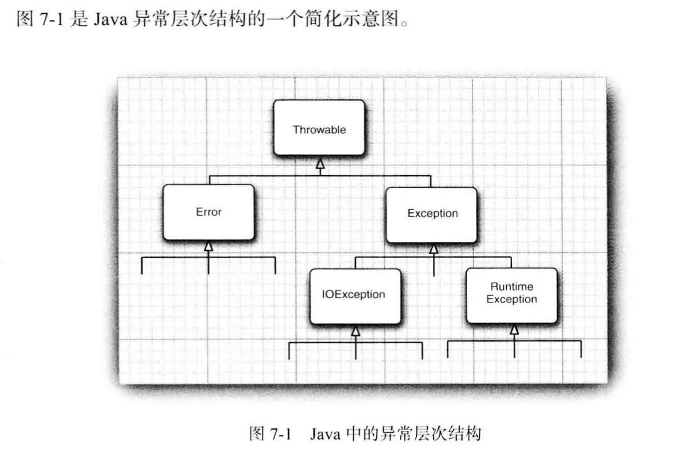

# 异常，断言和日志

* 处理错误
* 捕获异常
* 使用异常机制的技巧
* 使用断言
* 记录日志
* 调试技巧

## 处理错误

用户期望在出现错误时候，程序能够采用一些理智的行为。如果由于出现错误而使得某些操作没有完成，程序应该：

* 返回到一种安全状态，并能够让用户执行一些其他的命令，或者
* 允许用户保存所有操作的结果，并以妥善的方式终止程序

异常处理的任务就是将控制权从错误产生的地方转移给能够处理这种情况的错误处理器。为了能够在程序中处理异常情况，必须研究程序中可能出现的错误和问题，以及哪类问题需要关注。

* 用户输入错误
* 设备错误

  比如打印机可能没有打开，网页可能临时性地不能浏览。

* 物理限制

  磁盘满了

* 代码错误


### 异常分类

异常对象都是派生于Throwable类的一个实例，如果java中内置的异常类不能够满足需求，用户可以创建自己的异常类。



从图中可以看出，所有的异常都是由`Throwable`继承过来，但在下一层立即分解为两个分支：Error和Exception。

Error类层次结构描述了java运行系统的内部错误和资源耗尽错误。

在设计java程序时候，需要关注Exception层次结构。又分为两个分支：

* RuntimeException：由程序错误导致的异常
* IOException：程序本身没有问题，像io这类问题导致的异常属于其他异常。

java语言规范将派生于Error类或RuntimeException类的所有异常称为非受查异常，所有其他的异常称为受查异常。编译器将核查是否为所有的受查异常提供类异常处理器。

### 声明受查异常

如果遇到了无法处理的情况，那么java的方法可以抛出一个异常，方法应该在其首部声明所有可能抛出的异常。这样可以从首部反映出这个方法可能抛出哪类受查异常，例如：下面是标准类库中提供的FileInputStream类的一个构造器的声明

```java
public FileInputStream(String name) throws FileInputStream
```

这个声明表示这个构造器将根据给定的String参数产生一个FileInputStream对象，但也有可能抛出一个FileNotFoundException异常。如果发生了糟糕情况，构造器将不会初始化一个新的FileInputStream对象，而是抛出一个FileNotFoundException对象。如果真的抛出一个这样的异常对象，运行时系统就会开始搜索异常处理器，以便知道如何处理这个异常对象。

在自己编写方法时候，不必将所有可能抛出的异常都进行声明。下面4种情况应该抛出异常：

* 调用一个抛出受查异常的方法
* 程序运行过程中发现错误，并且利用throw语句抛出一个受查异常。
* 程序出现错误，例如：`a[-1]=0`会抛出一个ArrayIndexOutOfBoundException这样的非受查异常
* java虚拟机和运行时库出现的内部错误

如果出现前两种情况之一，则必须告诉调用这个方法的程序员有可能抛出异常。因为如果没有处理器捕获这个异常，当前执行的线程就会结束。

对于那些可能被他人使用的java方法，应该根据异常规范，在方法的首部声明这个方法可能抛出的异常，如果一个方法有可能抛出多个受查异常类型，那么就必须在方法的首部列出所有的异常类，每个异常类之间用逗号隔开。

总之，一个方法必须声明所有可能抛出的受查异常，而非受查异常要么不可控制，要么就应该避免发生。如果方法没有声明所有可能发生的受查异常，编译器就会发出一个错误消息。

当然，从前面的示例中可以知道，除了声明异常之外，还可以捕获异常。这样会使异常不被抛到方法之外，也不需要throws规范。稍后，将会讨论如何决定一个异常是被捕获，还是被抛出让其他的处理器进行处理。

如果类中的一个方法声明将会抛出一个异常，而这个异常是某个特定类的实例时，则这个方法就有可能抛出一个这个类的异常，或者这个类的任意一个子类的异常。

### 如何抛出异常

假设在代码中，一个名为readData的方法正在读取一个文件，读到733个字符后就结束了，我们认为这是一种不正常的情况，希望抛出一个异常。

首先要决定应该抛出什么类型的异常。将上述异常归结为IOException是一种很好的选择。查看API文档可知EOFException异常描述的是：在输入过程中，遇到一个未预期的EOF后的信号。下面是抛出这个异常的语句：

```java
throw new EOFException;
```

或者

```java
EOFException e=new EOFException();
throw e;
```

下面将这些代码放在一起：

```java
String readData(Scanner in) throws EOFException
{
  ...
  while(...)
  {
    if (!in.hasNext())//EOF encountered
    {
      if (n<len)
        throw new EOFException();
    }
    ...
  }
  return s;
}
```

EOFException类还有一个含有一个字符串型参数的构造器。这个构造器可以更加细致的描述异常出现的情况。

```java
String gripe="Content-length "+len+",Recived: "+n;
throw new EOFException(gripe);
```

在前面已经看到，对于一个已经存在的异常类，将其抛出非常容易。在这种情况下：

* 找到一个合适的异常类
* 创建这个类的一个对象
* 将对象抛出

一旦方法抛出了异常，这个方法就不可能返回到调用者。

### 创建异常类

我们需要做的只是定义一个派生于Exception的类，或者派生于Exception子类的类。习惯上，定义的类应该包含两个构造器，一个是默认的构造器，另一个是带有详细描述信息的构造器（超类Throwable的toString方法将会打印出这个详细信息）

```java
class FileFormatException extends IOException
{
  public FileFormatException(){}
  public FileFormatException(String gripe)
  {
    super(gripe);
  }
}
```

这样就定义好了一个异常类。

## 捕获异常

有时候，我们的代码必须捕获异常。

### 捕获异常

如果某个异常发生的时候没有在任何地方进行捕获，那么程序就会终止执行，并在控制台上打印出异常信息，其中包括异常的类型和堆栈的内容。

要想捕获一个异常，必须设置`try/catch`语句块。最简单的try语句如下：

```java
try
{
  code
  ...
}
catch (ExceptionType e)
{
  ...
  //handler for this type
}
```

如果在try语句块中的任何代码抛出了一个在catch子句中说明的异常类，那么

* 程序将跳过try语句块的其余代码
* 程序将执行catch子句中的处理器代码

如果在try语句块中的代码没有抛出任何异常，那么程序将跳过catch子句。

如果方法中的任何代码抛出了一个在catch子句中没有声明的异常类型，那么这个方法就会立刻退出。

`try/catch`这种处理异常的方法基本上合理，还有其他的选择吗，通常，最好的选择是什么也不做，而是将异常传递给调用者。如果采用这种处理方式，就必须声明这个方法可能会抛出一个IOException

请记住，编译器严格地执行throws说明符。如果调用了一个抛出受查异常的方法，就必须对它进行处理，或者继续传递。

哪种方法更好呢？通常，应该捕获那些知道如何处理的异常，而将那些不知道怎么样处理的异常继续进行传递。

如果想传递一个异常，就必须在方法的首部添加一个throws说明符以便告知调用者这个方法可能会抛出异常。

### 捕获多个异常

在一个try语句块中可以捕获多个异常类型，并对不同类型的异常作出不同的处理。可以按照下列方式为每个异常类型使用一个单独的catch子句：

```java
try
{
  code
}
catch (FileNotFoundException e)
{
  code
}
catch (IOException e)
{
  code
}
...
```

异常对象可能包含与异常本身相关的信息。要想获得对象的更多信息，可以试着使用`e.getMessage()`得到详细的错误信息（如果有的话），或者使用`e.getClass().getName()`得到异常对象的实际类型。

### 再次抛出异常与异常链

在catch子句中可以抛出一个异常，这样做的目的是改变异常的类型。如果开发了一个供其他程序员使用的子系统，那么，用于表示子系统故障的异常类型可能会产生多种解释。

下面给出了捕获异常并将它再次抛出的基本方法：

```java
try
{
  code
}
catch (SQLException e)
{
  throw new ServletException("database error: "+e.getMessage());
}
```

不过，还有一种更好的处理方法，并且将原始异常设置为新异常的原因：

```java
try
{
  code
}
catch (SQLException e)
{
  Throwable se=new ServletException("database error");
  se.init(e);
  throw se;
}
```

当捕获到异常时候，就可以使用下面这条语句重新得到原始异常：

```java
Throwable e=se.getCause();
```

强烈建议使用这种包装技术。这样就可以让用户抛出子系统中的高级异常，而不会丢失原始异常的细节。

### finally子句

Oh my god！！！！！！！！

写了好多，atom崩溃了，全没了，心态崩了，之后补充吧


直接跳到记录日志


## 记录日志

每个java程序员都很熟悉在有问题的代码中插入一些System.out.println方法调用来帮助观察程序运行的操作过程。记录日志API就是为了解决这个问题而设计的。下面讨论API的优点

* 可以很容易地取消全部日志记录，或者仅仅取消某个级别的日志，而且打开和关闭这个操作也很容易
* 可以很简单地禁止日志记录的输出，因此，将这些日志代码留在程序中的开销很小。
* 日志记录可以被定向到不同的处理器，用于在控制台中显示，用于存储在文件中等

### 基本日志

要生成简单的日志记录，可以使用全局日志记录器并调用其info方法：

```java
Logger.getGlobal().info("File->Open menu item selected");
```

在默认情况下，这条记录将会显示以下内容：

```
May 10,2013 10:12:15 PM LogginImageViewer fileOpen
INFO:File->Open menu item selected
```

但是，如果在适当的地方（如main开始）调用

```java
Logger.getGlobal().setLevel(Level.OFF);
```

将会取消所有的日志。

### 高级日志

从前面已经看到“虚拟日志”，下面继续看一下企业级日志。在一个专业的应用程序中，不要将所有的日志都记录到一个全局日志记录器中，而是可以自定义日志记录器。

可以调用getLogger方法创建或获取记录器：

```java
private static final Logger myLogger=Logger.getLogger("com.mycompany.myapp");

```


与包名类似，日志记录器名也有层次结构。而且，日志记录器的层次性更强，日志记录器的父与子将共享某些属性。例如，如果对com.mycompany日志记录器设置了日志级别，它的子记录器也会继承这个级别。

通常，有以下7个日志记录器级别：

* SEVERE
* WARNING
* INFO
* CONFIG
* FINE
* FINER
* FINEST

在默认情况下，只记录前三个级别。也可以设置其他的级别。例如

```java
Logger.setLevel(Level.FINE);
```

## 调试技巧

假设编写了一个程序，并对所有的异常进行了捕获和恰当的处理，然后，运行这个程序，出错了，怎么调试呢，这里书上写了13个调试技巧，我只知道一个。。。。。。这部分尝试一下再记录。
